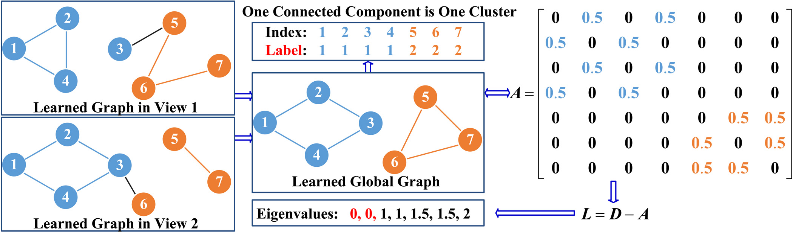

## Graph learning for multiview clustering
Most existing graph-based clustering methods need a predefined graph and their clustering performance highly depends on the quality of the graph. Aiming to improve the multiview clustering performance, a graph learning-based method is proposed to improve the quality of the graph. Initial graphs are learned from data points of different views, and the initial graphs are further optimized with a rank constraint on the Laplacian matrix. Then, these optimized graphs are integrated into a global graph with a well-designed optimization procedure. The global graph is learned by the optimization procedure with the same rank constraint on its Laplacian matrix. Because of the rank constraint, the cluster indicators are obtained directly by the global graph without performing any graph cut technique and the k-means clustering. Experiments are conducted on several benchmark datasets to verify the effectiveness and superiority of the proposed graph learning-based multiview clustering algorithm comparing to the state-of-the-art methods.



## Citation
We appreciate it if you cite the following paper:
```
@Article{tcybMVGL8052206,
  author =  {K. Zhan and C. Zhang and J. Guan and J. Wang},
  title =   {Graph Learning for Multiview Clustering},
  journal = {IEEE Transactions on Cybernetics},
  year =    {2018},
  volume =  {48},
  number =  {10},
  pages =   {2887--2895},
  doi =     {10.1109/TCYB.2017.2751646},
  issn =    {2168-2267}
}
```
<a href="https://doi.org/10.1109/TCYB.2017.2751646"></a>

## Contact
http://www.escience.cn/people/kzhan

If you have any questions, feel free to contact me. (Email: `ice.echo#gmail.com`)
